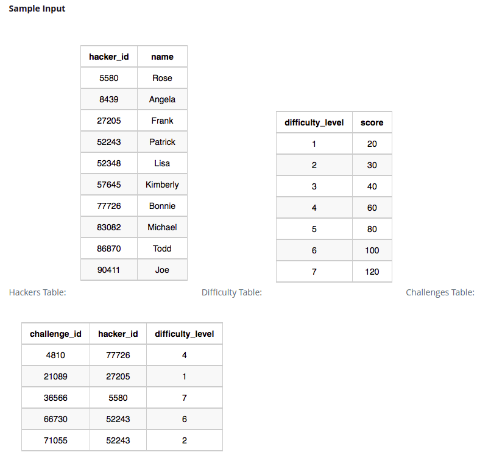
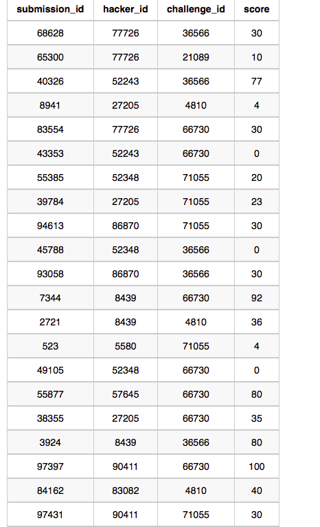
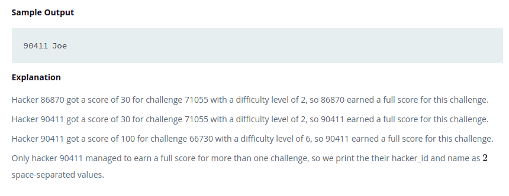

### Full Score
[Jump to the problem in the platform](https://www.hackerrank.com/challenges/full-score/problem)

#### Description
Julia just finished conducting a coding contest, and she needs your help assembling the leaderboard! Write a query to print the respective hacker_id and name of hackers who achieved full scores for more than one challenge. Order your output in descending order by the total number of challenges in which the hacker earned a full score. If more than one hacker received full scores in same number of challenges, then sort them by ascending hacker_id.

#### Input Format
The following tables contain contest data:
* Hackers: The hacker_id is the id of the hacker **(int)**, and name is the name of the hacker **(string)**.
* Difficulty: The difficult_level is the level of difficulty of the challenge **(int)**, and score is the score of the challenge for the difficulty level **(int)**. 
* Challenges: The challenge_id is the id of the challenge **(int)**, the hacker_id is the id of *the hacker who created* the challenge **(int)**, and difficulty_level is the level of difficulty of the challenge **(int)**. 
* Submissions: The submission_id is the id of the submission **(int)**, hacker_id is the id of *the hacker who made the submission* **(int)**, challenge_id is the id of the challenge that the submission belongs to **(int)**, and score is the score of the submission **(int)**.

#### Sample Input

#### Sample Output And Explanation

